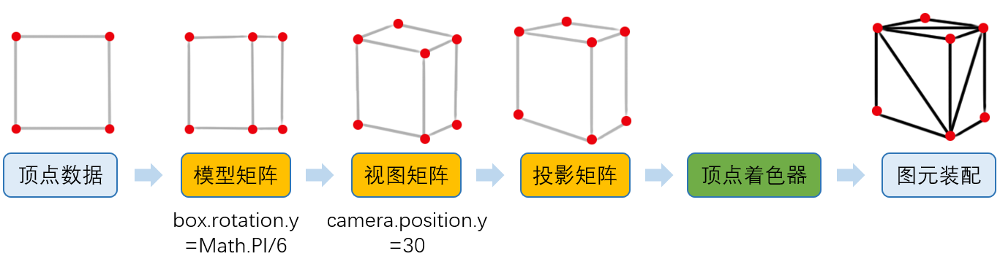

# 基于Three.js的三维全景漫游demo

> A Vue.js project

## Three.js

是一个基于**WebGL**封装的**JS**库,WebGL绘图API本身支持绘制点(Point),线(line),以及三角形(Triangle)

WebGL绘制过程包括以下三步：
1、获取顶点坐标 (三维软件导出,或者框架生成几何体)
2、图元装配（通过投影矩阵将三维世界坐标转换为屏幕坐标,并通过顶点着色器画出一个个三角形）
3、光栅化（通过openGL的片元着色器生成片元(像素)，即三角形中生成一个个像素点）


### Three.js做了些什么


这幅图,我们可以看到能做的,three.js基本上都帮我们做了:

- 辅助我们导出了模型数据；
- 自动生成了各种矩阵；
- 生成了顶点着色器；
- 辅助我们生成材质，配置灯光；
- 根据我们设置的材质生成了片元着色器

### Three.js处理顶点的流程



```javascript
// 模型本身顺时针旋转PI/6
box.rotation.y = Math.PI/6;
// 相机向上偏移30°
camera.position.y = 30;
// 投影到二维坐标...
```

如果我们把每个顶点用JS来进行计算,性能会很慢,所以我们对应转换的信息用矩阵(Martix)记录下来,通过GPU计算然后返回结果,具体过程如下:


### Three.js片元着色器处理流程


### Three.js完整运行流程


由上图可知,Three.js本身根据我们所选的材质,选择对应的顶点着色器和片元着色器

### Three.js基本步骤

1. 设置three.js渲染器 （定义全局变量 var renderer）

   三维空间里的物体映射到二维平面的过程被称为三维渲染。将进行渲染操作的叫做渲染器。

   ```javascript
   var webgl = document.getElementById('webgl');
   var renderer;//定义一个全局变量renderer（含义:渲染）
   function initThree(){
   //获取画布的宽高
   width = webgl.clientWidth;
   height = webgl.clientHeight;
   //生成渲染器对象（属性：抗锯齿效果为设置有效）
   renderer = new THREE.WebGLRenderer({antialias:true});
   //指定渲染器的高宽（和画布框大小一致）
   renderer.setSize(width, height );
   //将创建的canvas元素（此处的canvas元素为three.js创建）添加到html文档当中
   webgl.appendChild(renderer.domElement);
   //设置渲染器的清除色
   renderer.setClearColorHex(0xFFFFFF,1.0);
   }
   ```

   其中Three.js提供了很多渲染方式`WebGLRenderer `和`CanvasRenderer `,前者渲染效果更好,后者具有更好的兼容性.

2. 设置摄像机camera 

   三维空间中的物体投影到二维空间的方式中，存在透视投影和正投影两种相机。 透视投影就是、从视点开始越近的物体越大、远处的物体绘制的较小的一种方式、和日常生活中人眼看物体的方式是一致的。 正投影就是不管物体和视点距离，都按照统一的大小进行绘制、在建筑和设计等领域需要从各个角度来绘制物体，因此这种投影被广泛应用。

   ```javascript
   var camera;
   function initCamera() {
    camera = new THREE.PerspectiveCamera(45,width/height,1,10000);
    //此处为设置透视投影的相机，默认情况下，相机的上方向为Y轴，右方向为X轴，沿着Z轴垂直朝里（视野角：fov； 纵横比：aspect； 相机离视最近的距离：near； 相机离视体积最远距离：far）
    camera.position.x = 400;//设置相机的位置坐标
    camera.position.y = 0;
    camera.position.z = 0;
    //设置相机的上为z轴方向
    camera.up.x = 0;
    camera.up.y = 0;
    camera.up.z = 1;
    //设置视野的中心坐标
    camera.lookAt({x:0, y:0, z:0});
   } 
   ```

3. 设置场景scene 

   场景就是一个三维空间。用Scene这个类进行申明

   ```javascript
   var scene; 
   function initScene() { 
   scene = new THREE.Scene(); 
   } 
   ```

4. 设置光源light 

   OpenGL（WebGL）的三维空间中，存在点光源和聚光灯两种类型。 而且，作为点光源的一种特例还存在平行光源(无线远光源)。另外，作为光源的参数还可以进行 [环境光] 等设置。 作为对应， Three.js中可以设置 [点光源(Point Light)] [聚光灯(Spot Light)] [平行光源(Direction Light)]，和 [环境光(Ambient Light)]。 在一个场景中可以设置多个光源。 基本上，都是环境光和其他几种光源进行组合。 如果不设置环境光，那么光线照射不到的面会变得过于黑暗。 首先按照下面的步骤设置平行光源，在这之后还会追加环境光。

   ```javascript
   var light;
   function initLight() {
    light = new THREE.DirectionalLight(0x0000FF,1.0,0);//设置平行光DirectionalLight
    light.position.set(50,50,50);//光源向量，即光源的位置
    //还可以添加多个光源，多行注释中即为添加2、3号光源
    /*light2 = new THREE.DirectionalLight(0xFF00CC,1.0,0);
    light2.position.set(0,50,0);
    light3 = new THREE.DirectionalLight(0x0000CC,1.0,0);
    light3.position.set(50,0,0);*/
    scene.add(light);//追加光源到场景
    /*scene.add(light2);
    scene.add(light3);*/
   }
   ```

5. 设置物体object 

   ```javascript
   var cube=Array();
   function initObject() {
    for(var i=0;i<4;i++){
     cube[i]=new THREE.Mesh(//mesh是three.js的一个类
      new THREE.CubeGeometry(50,50,50),//形状 (宽 高 深度)
      new THREE.MeshLambertMaterial({color:0x0000FF})//材质
     );
     scene.add(cube[i]);
     cube[i].position.set(0,-120+80*i,0);
    }
   }
   ```

6. 书写主函数

   ```javascript
   var t=0;
   function loop(){
    t++;
    renderer.clear();
    cube[0].rotation.set(t/100,0,0);
    cube[1].rotation.set(0,t/100,0); 
    cube[2].rotation.set(0,0,t/100);
    /*camera.position.x = 400*Math.cos(t/100);
    camera.position.y = 400*Math.sin(t/200);
    camera.position.z = 50*Math.cos(t/100);*/
    camera.lookAt( {x:0, y:0, z:0 } );
    renderer.render(scene,camera);
    window.requestAnimationFrame(loop);
   }
   ```

## 项目结构以及思路

### 思路

具体参考: Three.js的官方例子

图形学相关思路参考:[Three.js全景漫游项目]()

项目具体业务逻辑实现:[vrsystem相关说明]()


## 参考

[Three.js工作原理](https://www.cnblogs.com/wanbo/)


## 安装

``` bash
# 安装依赖
npm install

# serve with hot reload at localhost:8080
npm run dev

# build for production with minification
npm run build

# build for production and view the bundle analyzer report
npm run build --report
```
